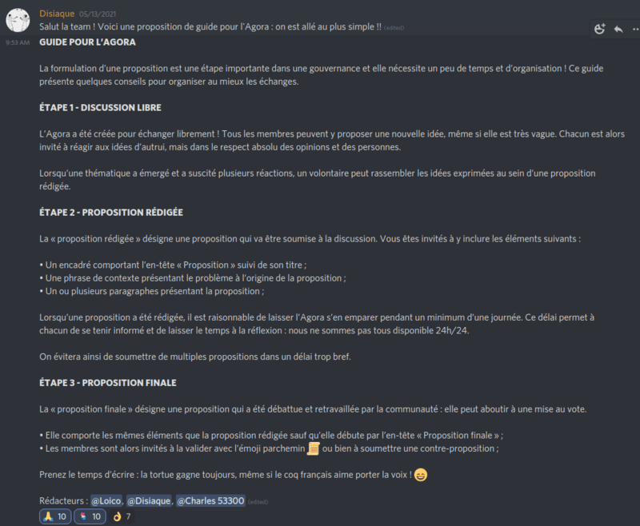

# 🗳 Gouvernance communautaire

### `#🏟-agora` : la gouvernance communautaire

**Les emojis-actions permettent également de s'impliquer directement dans la gouvernance** de DeFi France. Sur un canal spécifique, l'`#🏟-agora`, les membres peuvent discuter de leurs propositions d'améliorations. Lorsqu'ils atteignent un consensus sur une proposition, ils peuvent la formaliser afin de la soumettre à l'`#🏟-agora`.

Notre scribe Disiaque a même proposé une formalisation du processus pour structurer les échanges et le chemin jusqu'au vote :&#x20;

Tout comme pour le hors-sujet ou la fonction sauvegarde, **si un minimum de 10% du blé réagit avec l'emoji parchemin 📜**, alors la proposition est soumise au vote de la communauté dans le canal `#📜-proposition`.

.png>)

**Le vote est pondéré par le blé** et les membres ont trois jours pour se prononcer. L'implémentation effective se fait dans un délai raisonnable suivant la conclusion du vote, en fonction de la complexité technique de la proposition.
