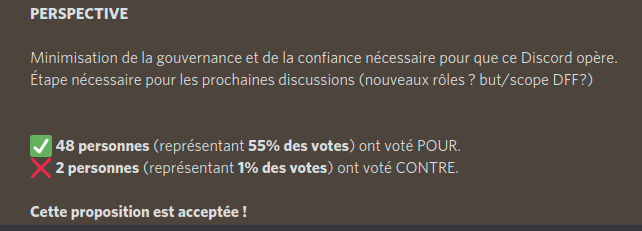
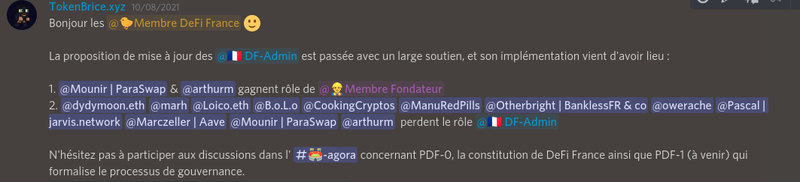

# 📜 #-1 - Mise à jour et clarification du rôle DF-Admin

Formalisation : 05 Octobre 2021

Vote Agora : 05 Octobre 2021

Implémentation : 08 Octobre 2021

| ID          | PROPOSITION                                   | CLÔTURE    | VOTE POUR | VOTRE CONTRE | STATUT   |
| ----------- | --------------------------------------------- | ---------- | --------- | ------------ | -------- |
| **PDF -**15 | Mise à jour et clarification du rôle DF-Admin | 08/10/2021 | 48 (55 %) | 2 (1 %)      | Acceptée |

## **PROPOSITION ORIGINALE**

### **BUT**

Mise à jour et clarification du rôle @🇫🇷 DF-Admin

### **CHANGEMENTS**

**1. Admin Technique** Le rôle administrateur est renommé admin technique. Pas de changement sur les permissions. Démotion de tous les administrateurs actuels sauf Nolan (maintien Déméter) et moi-même (gestion jour-le-jour Discord)

**2. Création d'un rôle membre d'honneur** – purement honorifique (aucun privilège sauf couleur) pour les créateurs originels de DeFi France, toujours actif sur les meetups : Mounir et Arthur + alouable par vote Agora / meme emoji à terme ?

### **IMPLÉMENTATION**

Si les termes présentés plus haut vous conviennent, Nolan ou moi-même peuvent implémenter la décision qui sera donc concrètement :

* Demote tous les admins sauf Nolan et TokenBrice
* Promote Mounir & Arthur à Membre Fondateur

### **PERSPECTIVE**

Minimisation de la gouvernance et de la confiance nécessaire pour que ce Discord opère. Étape nécessaire pour les prochaines discussions (nouveaux rôles ? but/scope DFF?)
